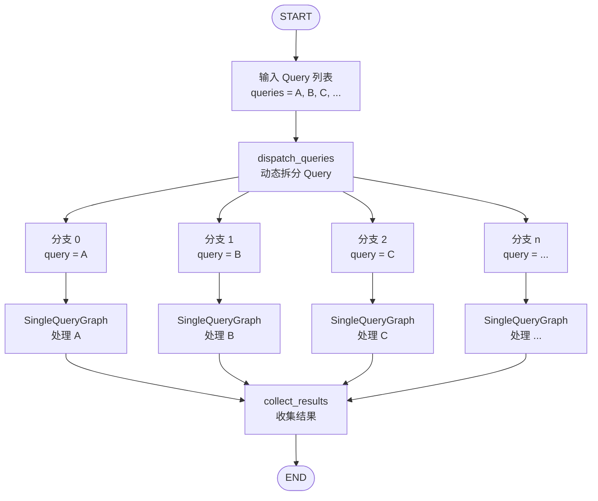
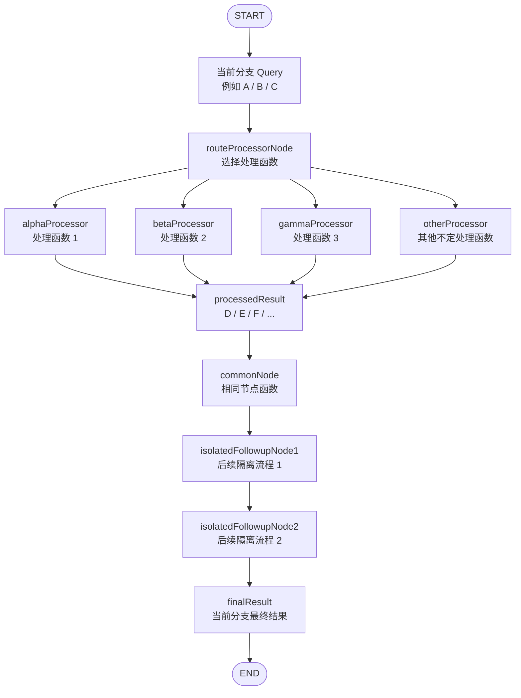
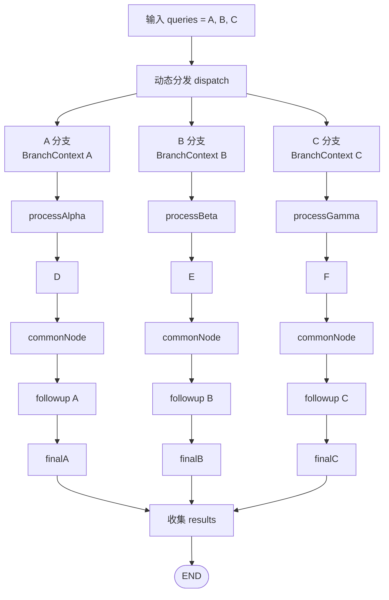
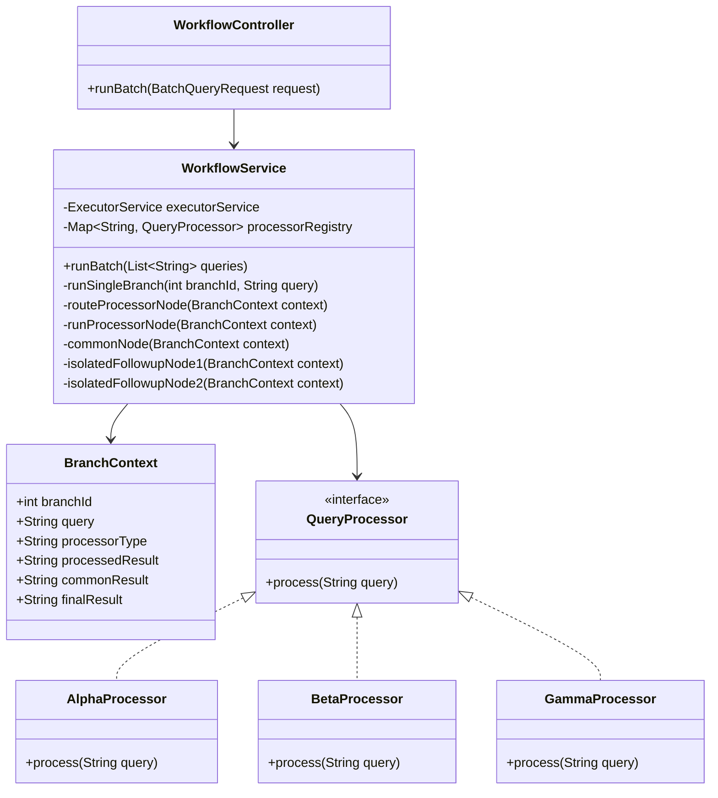
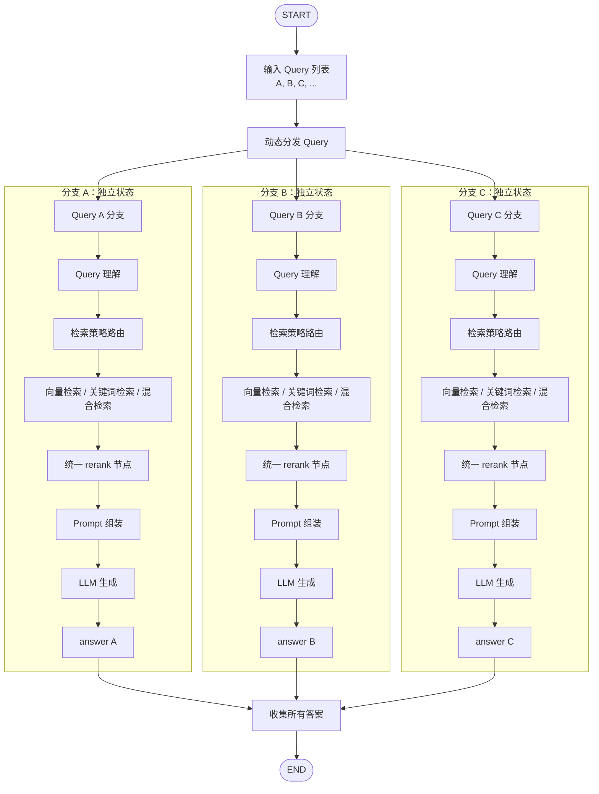

可以实现，而且这个场景正是 LangGraph 里 **动态并行分支 / Map-Reduce / Send API / 子图隔离** 比较适合的用法。

你的需求可以抽象成：

```text
输入：
Query列表 = [A, B, C, ...]

阶段1：每个 Query 走不同/不定的处理函数
A -> process_x -> D
B -> process_y -> E
C -> process_z -> F

阶段2：D/E/F 进入同一个节点函数 common_node
D -> common_node -> 后续流程1
E -> common_node -> 后续流程2
F -> common_node -> 后续流程3

要求：
每条分支互不影响，后续流程也隔离。
最后可以选择是否汇总。
```

LangGraph 可以通过 `Send` 动态派发多个分支。官方文档明确说明 `Send API` 支持 map-reduce 和高级分支模式，可以根据列表动态生成多个并行任务；并且 LangGraph 的节点、边、状态机制本身就是用于编排复杂工作流的。([LangChain 文档](https://docs.langchain.com/oss/python/langgraph/use-graph-api)) 另外，官方文档也说明节点可以并行执行，分支扇出后再汇入时需要用 reducer 管理共享状态更新。([LangChain 文档](https://docs.langchain.com/oss/python/langgraph/use-graph-api))

------

## 推荐方案：父图负责派发，子图负责单个 Query 的完整隔离流程

### 总体结构

```text
Parent Graph
│
├── start
│
├── dispatch_queries
│     ├── Send("run_one_query", {query: A, branch_id: "0"})
│     ├── Send("run_one_query", {query: B, branch_id: "1"})
│     └── Send("run_one_query", {query: C, branch_id: "2"})
│
├── run_one_query
│     └── 调用 SingleQuery Subgraph
│
└── collect_results / END
```

每个 `run_one_query` 实际上只做一件事：把当前分支的 `query` 交给一个 **单 Query 子图**。子图内部完成：

```text
query
  -> 选择不同处理函数
  -> 得到 processed_result
  -> 进入相同 common_node
  -> 后续节点1
  -> 后续节点2
  -> branch_output
```

LangGraph 官方文档中，子图可以作为另一个图里的节点使用；如果父图和子图状态结构不同，需要在父节点中手动做输入/输出转换。这个模式特别适合“每个分支有自己的私有状态”的情况。([LangChain 文档](https://docs.langchain.com/oss/python/langgraph/use-subgraphs)) 子图默认的 per-invocation 模式也适合每次独立调用，官方文档说明这种模式下每次调用从新状态开始，并支持并行调用时保持每次 invocation 隔离。([LangChain 文档](https://docs.langchain.com/oss/python/langgraph/use-subgraphs))

------

## 关键点：不要让分支直接写同一个普通字段

LangGraph 的 `StateGraph` 是基于状态更新工作的。默认情况下，如果多个并行分支都写同一个字段，可能会覆盖或冲突；如果要把多个分支结果收集起来，应给这个字段配置 reducer，例如 `operator.add`，让多个分支的结果追加到列表中。官方文档也说明 reducer 用于控制多个节点更新同一状态 key 时如何合并，例如列表拼接。([LangChain 文档](https://docs.langchain.com/oss/python/langgraph/use-graph-api))

所以应该这样设计：

```python
results: Annotated[list[dict], operator.add]
```

每个分支只返回：

```python
{"results": [当前分支结果]}
```

而不是：

```python
{"result": 当前分支结果}
```

------

# 完整示例代码骨架

下面这个例子模拟：

```text
A -> process_alpha -> D -> common_node -> 后续流程
B -> process_beta  -> E -> common_node -> 后续流程
C -> process_gamma -> F -> common_node -> 后续流程
```

## 1. 安装

```bash
pip install -U langgraph
```

------

## 2. 单个 Query 的隔离子图

```python
from typing_extensions import TypedDict
from langgraph.graph import StateGraph, START, END


# =========================
# 1. 单 Query 子图状态
# =========================

class SingleQueryState(TypedDict, total=False):
    branch_id: str
    query: str

    # 选择哪个处理函数
    processor_type: str

    # 不同处理函数得到的中间结果，比如 D/E/F
    processed_result: str

    # 进入相同 common_node 后的结果
    common_result: str

    # 后续隔离流程结果
    final_answer: str


# =========================
# 2. 不同处理函数
# =========================

def process_alpha(query: str) -> str:
    return f"D_alpha_result_from_{query}"


def process_beta(query: str) -> str:
    return f"E_beta_result_from_{query}"


def process_gamma(query: str) -> str:
    return f"F_gamma_result_from_{query}"


PROCESSOR_REGISTRY = {
    "alpha": process_alpha,
    "beta": process_beta,
    "gamma": process_gamma,
}


# =========================
# 3. 选择处理函数
# =========================

def choose_processor_node(state: SingleQueryState) -> SingleQueryState:
    query = state["query"]

    # 示例规则：真实项目中可以换成意图识别、路由模型、配置表等
    if query.startswith("A"):
        processor_type = "alpha"
    elif query.startswith("B"):
        processor_type = "beta"
    else:
        processor_type = "gamma"

    return {
        "processor_type": processor_type
    }


# =========================
# 4. 执行不同处理函数
# =========================

def run_processor_node(state: SingleQueryState) -> SingleQueryState:
    processor_type = state["processor_type"]
    query = state["query"]

    processor_func = PROCESSOR_REGISTRY[processor_type]
    processed_result = processor_func(query)

    return {
        "processed_result": processed_result
    }


# =========================
# 5. 相同节点函数：common_node
# =========================

def common_node(state: SingleQueryState) -> SingleQueryState:
    processed = state["processed_result"]

    # 这里就是 D/E/F 进入的同一个节点函数
    common_result = f"common_processed({processed})"

    return {
        "common_result": common_result
    }


# =========================
# 6. 后续隔离流程
# =========================

def isolated_followup_node(state: SingleQueryState) -> SingleQueryState:
    branch_id = state["branch_id"]
    query = state["query"]
    common_result = state["common_result"]

    final_answer = (
        f"[branch={branch_id}] query={query}, "
        f"final_answer_from_{common_result}"
    )

    return {
        "final_answer": final_answer
    }


# =========================
# 7. 构建单 Query 子图
# =========================

single_query_builder = StateGraph(SingleQueryState)

single_query_builder.add_node("choose_processor", choose_processor_node)
single_query_builder.add_node("run_processor", run_processor_node)
single_query_builder.add_node("common_node", common_node)
single_query_builder.add_node("isolated_followup", isolated_followup_node)

single_query_builder.add_edge(START, "choose_processor")
single_query_builder.add_edge("choose_processor", "run_processor")
single_query_builder.add_edge("run_processor", "common_node")
single_query_builder.add_edge("common_node", "isolated_followup")
single_query_builder.add_edge("isolated_followup", END)

single_query_graph = single_query_builder.compile()
```

这个子图的特点是：每次只处理一个 Query。A、B、C 虽然都调用同一个 `common_node`，但它们传入的是各自的 `SingleQueryState`，所以不会互相污染。

------

## 3. 父图：动态接收 Query 列表并并行派发

```python
import operator
from typing_extensions import TypedDict, Annotated
from langgraph.graph import StateGraph, START, END
from langgraph.types import Send


# =========================
# 1. 父图状态
# =========================

class ParentState(TypedDict, total=False):
    queries: list[str]

    # 用 reducer 收集多个分支结果
    results: Annotated[list[dict], operator.add]

    # Send 给 run_one_query 时使用的分支局部字段
    branch_id: str
    query: str


# =========================
# 2. 空节点，用于作为 Send 的起点
# =========================

def prepare_node(state: ParentState) -> ParentState:
    return {}


# =========================
# 3. 根据 Query 列表动态派发多个分支
# =========================

def dispatch_queries(state: ParentState):
    sends = []

    for idx, query in enumerate(state["queries"]):
        sends.append(
            Send(
                "run_one_query",
                {
                    "branch_id": str(idx),
                    "query": query,
                }
            )
        )

    return sends


# =========================
# 4. 每个分支调用一次子图
# =========================

def run_one_query_node(state: ParentState) -> ParentState:
    branch_input = {
        "branch_id": state["branch_id"],
        "query": state["query"],
    }

    # 每个分支独立调用子图
    branch_output = single_query_graph.invoke(branch_input)

    return {
        "results": [
            {
                "branch_id": branch_output["branch_id"],
                "query": branch_output["query"],
                "processor_type": branch_output["processor_type"],
                "processed_result": branch_output["processed_result"],
                "common_result": branch_output["common_result"],
                "final_answer": branch_output["final_answer"],
            }
        ]
    }


# =========================
# 5. 构建父图
# =========================

parent_builder = StateGraph(ParentState)

parent_builder.add_node("prepare", prepare_node)
parent_builder.add_node("run_one_query", run_one_query_node)

parent_builder.add_edge(START, "prepare")

# prepare 后动态 Send 到多个 run_one_query
parent_builder.add_conditional_edges(
    "prepare",
    dispatch_queries,
    ["run_one_query"]
)

parent_builder.add_edge("run_one_query", END)

parent_graph = parent_builder.compile()
```

------

## 4. 调用

```python
if __name__ == "__main__":
    result = parent_graph.invoke({
        "queries": ["A", "B", "C"]
    })

    for item in result["results"]:
        print(item)
```

可能输出类似：

```python
{
  'branch_id': '0',
  'query': 'A',
  'processor_type': 'alpha',
  'processed_result': 'D_alpha_result_from_A',
  'common_result': 'common_processed(D_alpha_result_from_A)',
  'final_answer': '[branch=0] query=A, final_answer_from_common_processed(D_alpha_result_from_A)'
}

{
  'branch_id': '1',
  'query': 'B',
  'processor_type': 'beta',
  'processed_result': 'E_beta_result_from_B',
  'common_result': 'common_processed(E_beta_result_from_B)',
  'final_answer': '[branch=1] query=B, final_answer_from_common_processed(E_beta_result_from_B)'
}

{
  'branch_id': '2',
  'query': 'C',
  'processor_type': 'gamma',
  'processed_result': 'F_gamma_result_from_C',
  'common_result': 'common_processed(F_gamma_result_from_C)',
  'final_answer': '[branch=2] query=C, final_answer_from_common_processed(F_gamma_result_from_C)'
}
```

------

# 你的场景中应该如何落地

如果你是在做 RAG / 多 Query 检索编排，可以按下面这样改：

```text
ParentGraph
  输入：queries = [A, B, C, ...]

  dispatch_queries:
    A -> SingleQueryGraph
    B -> SingleQueryGraph
    C -> SingleQueryGraph

SingleQueryGraph
  query
    -> query_understanding / query_rewrite / intent_route
    -> 不同处理函数
    -> unified_retrieval_node
    -> rerank_node
    -> prompt_assemble_node
    -> llm_generate_node
    -> final_answer
```

也就是说：

```text
A/B/C 的处理结果 D/E/F
不是放到一个全局 list 再一起处理，
而是分别进入同一个 common_node 的不同 invocation。
```

这样才是真正隔离。

------

# “不定个不同处理函数”怎么处理？

有三种方式。

## 方式一：函数注册表，最推荐

适合处理函数数量不固定，但结构一致的情况。

```python
PROCESSOR_REGISTRY = {
    "rewrite": rewrite_func,
    "embedding": embedding_func,
    "keyword": keyword_func,
    "hybrid": hybrid_func,
}
```

节点内部根据 `processor_type` 选择函数：

```python
func = PROCESSOR_REGISTRY[state["processor_type"]]
result = func(state["query"])
```

优点是图结构稳定，不需要每次重新 compile。

------

## 方式二：不同处理函数做成不同节点

适合每类处理函数的后续流程不同。

```text
route_node
  ├── alpha_node -> common_node
  ├── beta_node  -> common_node
  └── gamma_node -> common_node
```

缺点是节点种类需要在编译图之前确定。LangGraph 的图通常是先定义节点和边，然后 `compile()` 后运行；运行时可以动态分支数量，但不适合动态新增未知节点。

------

## 方式三：每种处理流程做成不同子图

适合复杂场景：

```text
A -> alpha_subgraph -> common_node -> followup
B -> beta_subgraph  -> common_node -> followup
C -> gamma_subgraph -> common_node -> followup
```

如果你的不同处理函数其实是不同 Agent、不同检索策略、不同工具链，这种更清晰。

------

# 隔离性设计原则

你要保证以下几点：

| 设计点              | 推荐做法                                     |
| ------------------- | -------------------------------------------- |
| 每个 Query 独立状态 | 用 `Send` 给每个分支传独立 `branch_id/query` |
| 后续流程隔离        | 把单 Query 流程封装成子图                    |
| 共同节点函数        | 在子图里使用同一个 `common_node`             |
| 多分支结果收集      | 父图只收集 `results`                         |
| 避免状态污染        | 不让分支写同一个普通字段                     |
| 结果合并            | 使用 `Annotated[list, operator.add]` reducer |
| 调试                | 每条分支保留 `branch_id`                     |

------

# 最终结论

**能实现。**

你的需求在 LangGraph 中最合适的实现方式是：

```text
父图：接收 Query 列表，用 Send 动态并行派发
子图：每个 Query 一次独立 invocation
子图内部：不同处理函数 -> 相同 common_node -> 后续隔离流程
父图最后：只收集每个分支的最终结果
```

这样可以同时满足：

```text
Query 数量不定
处理函数可变
D/E/F 进入相同节点函数
每个分支状态隔离
后续流程隔离
最终可选择是否汇总
```


可以。Java 里最直接的实现方式不是强行找 Python LangGraph 的 `Send` 等价物，而是用：

```text
CompletableFuture + ExecutorService + 每个分支独立 Context 对象
```

如果你想接近 LangGraph 的图式编排，也可以用 Java 生态里的 **LangGraph4j**。LangGraph4j 是 Java 版图编排库，支持 `StateGraph`、`AgentState`、节点、边、异步节点，并且可以和 Spring AI / LangChain4j 集成。它的文档里也说明状态由 `AgentState` 管理，节点返回状态更新，节点可以是同步或基于 `CompletableFuture` 的异步节点。([LangGraph4j](https://langgraph4j.github.io/langgraph4j/getting-started/))

但你这个需求本质是：

```text
Query列表
  -> 动态拆成多个分支
  -> 每个分支选择不同处理函数
  -> 进入同一个 commonNode
  -> 后续流程完全隔离
  -> 最后收集结果
```

用 Java 原生并发实现更清楚、更容易接到 Spring Boot 项目里。

------

# 一、整体设计

## 1. 每个 Query 独立一个上下文对象

不要让 A、B、C 共用状态。

```java
BranchContext
```

每个分支有自己的：

```text
branchId
query
processorType
processedResult
commonResult
finalResult
metadata
```

------

## 2. 不同处理函数用注册表管理

```java
Map<String, QueryProcessor> processorRegistry
```

例如：

```text
alphaProcessor: A -> D
betaProcessor:  B -> E
gammaProcessor: C -> F
```

------

## 3. commonNode 是同一个函数，但每个分支传自己的 Context

```java
D -> commonNode(contextA)
E -> commonNode(contextB)
F -> commonNode(contextC)
```

虽然调用的是同一个函数，但状态对象不同，所以互相隔离。

------

## 4. 后续流程继续在当前分支内执行

```text
branch A:
A -> D -> commonNode -> followup1 -> followup2 -> finalA

branch B:
B -> E -> commonNode -> followup1 -> followup2 -> finalB

branch C:
C -> F -> commonNode -> followup1 -> followup2 -> finalC
```

------

# 二、完整 Java 示例代码

这个示例不依赖任何第三方库，JDK 17+ 可以直接运行。

文件名：

```text
IsolatedWorkflowDemo.java
```

代码：

```java
import java.util.ArrayList;
import java.util.Comparator;
import java.util.HashMap;
import java.util.List;
import java.util.Map;
import java.util.concurrent.CompletableFuture;
import java.util.concurrent.ExecutorService;
import java.util.concurrent.Executors;
import java.util.function.Function;

public class IsolatedWorkflowDemo {

    /**
     * 每个分支独立持有自己的状态。
     * 注意：这里使用不可变 record，每一步返回一个新的 BranchContext，
     * 可以避免多个线程共享同一个可变对象导致状态污染。
     */
    public record BranchContext(
            int branchId,
            String query,
            String processorType,
            String processedResult,
            String commonResult,
            String finalResult,
            Map<String, Object> metadata
    ) {
        public static BranchContext start(int branchId, String query) {
            return new BranchContext(
                    branchId,
                    query,
                    null,
                    null,
                    null,
                    null,
                    new HashMap<>()
            );
        }

        public BranchContext withProcessorType(String processorType) {
            return new BranchContext(
                    branchId,
                    query,
                    processorType,
                    processedResult,
                    commonResult,
                    finalResult,
                    metadata
            );
        }

        public BranchContext withProcessedResult(String processedResult) {
            return new BranchContext(
                    branchId,
                    query,
                    processorType,
                    processedResult,
                    commonResult,
                    finalResult,
                    metadata
            );
        }

        public BranchContext withCommonResult(String commonResult) {
            return new BranchContext(
                    branchId,
                    query,
                    processorType,
                    processedResult,
                    commonResult,
                    finalResult,
                    metadata
            );
        }

        public BranchContext withFinalResult(String finalResult) {
            return new BranchContext(
                    branchId,
                    query,
                    processorType,
                    processedResult,
                    commonResult,
                    finalResult,
                    metadata
            );
        }
    }

    /**
     * 不同 Query 的处理函数统一实现这个接口。
     */
    @FunctionalInterface
    public interface QueryProcessor {
        String process(String query);
    }

    /**
     * 工作流编排器。
     */
    public static class IsolatedWorkflowEngine {

        private final ExecutorService executorService;
        private final Map<String, QueryProcessor> processorRegistry = new HashMap<>();

        public IsolatedWorkflowEngine(int threadPoolSize) {
            this.executorService = Executors.newFixedThreadPool(threadPoolSize);
            registerDefaultProcessors();
        }

        /**
         * 注册不同处理函数。
         * 以后如果有新的处理函数，只需要继续 put 即可。
         */
        private void registerDefaultProcessors() {
            processorRegistry.put("alpha", query -> "D_alpha_result_from_" + query);
            processorRegistry.put("beta", query -> "E_beta_result_from_" + query);
            processorRegistry.put("gamma", query -> "F_gamma_result_from_" + query);
        }

        /**
         * 对外暴露的方法：传入 Query 列表，返回每个 Query 的独立结果。
         */
        public List<BranchContext> run(List<String> queries) {
            List<CompletableFuture<BranchContext>> futures = new ArrayList<>();

            for (int i = 0; i < queries.size(); i++) {
                int branchId = i;
                String query = queries.get(i);

                CompletableFuture<BranchContext> future =
                        CompletableFuture.supplyAsync(
                                () -> runSingleBranch(branchId, query),
                                executorService
                        );

                futures.add(future);
            }

            CompletableFuture<Void> allDone =
                    CompletableFuture.allOf(futures.toArray(new CompletableFuture[0]));

            allDone.join();

            return futures.stream()
                    .map(CompletableFuture::join)
                    .sorted(Comparator.comparingInt(BranchContext::branchId))
                    .toList();
        }

        /**
         * 单个 Query 的完整隔离流程。
         */
        private BranchContext runSingleBranch(int branchId, String query) {
            BranchContext context = BranchContext.start(branchId, query);

            context = routeProcessorNode(context);
            context = runProcessorNode(context);
            context = commonNode(context);
            context = isolatedFollowupNode1(context);
            context = isolatedFollowupNode2(context);

            return context;
        }

        /**
         * 路由节点：决定当前 Query 使用哪个处理函数。
         *
         * 这里为了演示，简单根据 Query 前缀判断。
         * 真实项目中可以换成：
         * 1. 意图识别
         * 2. Query 分类模型
         * 3. 配置表
         * 4. 规则引擎
         * 5. LLM 路由
         */
        private BranchContext routeProcessorNode(BranchContext context) {
            String query = context.query();

            String processorType;

            if (query.startsWith("A")) {
                processorType = "alpha";
            } else if (query.startsWith("B")) {
                processorType = "beta";
            } else {
                processorType = "gamma";
            }

            return context.withProcessorType(processorType);
        }

        /**
         * 执行不同处理函数。
         */
        private BranchContext runProcessorNode(BranchContext context) {
            QueryProcessor processor = processorRegistry.get(context.processorType());

            if (processor == null) {
                throw new IllegalArgumentException(
                        "No processor found for type: " + context.processorType()
                );
            }

            String processedResult = processor.process(context.query());

            return context.withProcessedResult(processedResult);
        }

        /**
         * 相同节点函数。
         *
         * A、B、C 处理后的 D、E、F 都会进入这个函数。
         * 但是每次调用传入的是不同 BranchContext，所以互相隔离。
         */
        private BranchContext commonNode(BranchContext context) {
            String commonResult = "common_processed(" + context.processedResult() + ")";
            return context.withCommonResult(commonResult);
        }

        /**
         * 后续隔离流程 1。
         */
        private BranchContext isolatedFollowupNode1(BranchContext context) {
            String result = context.commonResult() + " -> followup_step_1";
            return context.withCommonResult(result);
        }

        /**
         * 后续隔离流程 2。
         */
        private BranchContext isolatedFollowupNode2(BranchContext context) {
            String finalResult = "[branchId=" + context.branchId() + "] "
                    + "query=" + context.query()
                    + ", processor=" + context.processorType()
                    + ", final=" + context.commonResult() + " -> followup_step_2";

            return context.withFinalResult(finalResult);
        }

        public void shutdown() {
            executorService.shutdown();
        }
    }

    public static void main(String[] args) {
        IsolatedWorkflowEngine engine = new IsolatedWorkflowEngine(4);

        List<String> queries = List.of("A", "B", "C", "A_2", "B_2");

        List<BranchContext> results = engine.run(queries);

        for (BranchContext result : results) {
            System.out.println("====================================");
            System.out.println("branchId        = " + result.branchId());
            System.out.println("query           = " + result.query());
            System.out.println("processorType   = " + result.processorType());
            System.out.println("processedResult = " + result.processedResult());
            System.out.println("commonResult    = " + result.commonResult());
            System.out.println("finalResult     = " + result.finalResult());
        }

        engine.shutdown();
    }
}
```

------

# 三、运行结果示例

```text
====================================
branchId        = 0
query           = A
processorType   = alpha
processedResult = D_alpha_result_from_A
commonResult    = common_processed(D_alpha_result_from_A) -> followup_step_1
finalResult     = [branchId=0] query=A, processor=alpha, final=common_processed(D_alpha_result_from_A) -> followup_step_1 -> followup_step_2

====================================
branchId        = 1
query           = B
processorType   = beta
processedResult = E_beta_result_from_B
commonResult    = common_processed(E_beta_result_from_B) -> followup_step_1
finalResult     = [branchId=1] query=B, processor=beta, final=common_processed(E_beta_result_from_B) -> followup_step_1 -> followup_step_2

====================================
branchId        = 2
query           = C
processorType   = gamma
processedResult = F_gamma_result_from_C
commonResult    = common_processed(F_gamma_result_from_C) -> followup_step_1
finalResult     = [branchId=2] query=C, processor=gamma, final=common_processed(F_gamma_result_from_C) -> followup_step_1 -> followup_step_2
```

------

# 四、对应到你的 RAG 场景

如果你要做 RAG，可以这样替换：

```text
Query数组：[A, B, C]

每个 Query 分支：

routeProcessorNode
    -> 判断是普通检索、向量检索、关键词检索、混合检索、图检索

runProcessorNode
    -> 执行对应检索策略

commonNode
    -> 对召回结果统一格式化 / 去重 / rerank

isolatedFollowupNode1
    -> prompt 组装

isolatedFollowupNode2
    -> LLM 生成

最终：
    -> 收集每个 Query 的 answer
```

对应结构：

```text
A -> query理解 -> 检索策略A -> common rerank -> prompt -> LLM -> answerA
B -> query理解 -> 检索策略B -> common rerank -> prompt -> LLM -> answerB
C -> query理解 -> 检索策略C -> common rerank -> prompt -> LLM -> answerC
```

------

# 五、如果接 Spring Boot，可以这样写成 Service

```java
@Service
public class WorkflowService {

    private final ExecutorService executorService = Executors.newFixedThreadPool(8);

    private final Map<String, QueryProcessor> processorRegistry = Map.of(
            "dense", query -> denseVectorSearch(query),
            "sparse", query -> sparseVectorSearch(query),
            "hybrid", query -> hybridSearch(query)
    );

    public List<BranchContext> runBatch(List<String> queries) {
        List<CompletableFuture<BranchContext>> futures = new ArrayList<>();

        for (int i = 0; i < queries.size(); i++) {
            int branchId = i;
            String query = queries.get(i);

            futures.add(
                    CompletableFuture.supplyAsync(
                            () -> runOneQuery(branchId, query),
                            executorService
                    )
            );
        }

        CompletableFuture.allOf(futures.toArray(new CompletableFuture[0])).join();

        return futures.stream()
                .map(CompletableFuture::join)
                .sorted(Comparator.comparingInt(BranchContext::branchId))
                .toList();
    }

    private BranchContext runOneQuery(int branchId, String query) {
        BranchContext context = BranchContext.start(branchId, query);

        context = route(context);
        context = retrieve(context);
        context = rerankCommonNode(context);
        context = buildPrompt(context);
        context = callLlm(context);

        return context;
    }

    private BranchContext route(BranchContext context) {
        String query = context.query();

        String processorType;
        if (query.contains("技能") || query.contains("英雄")) {
            processorType = "hybrid";
        } else if (query.length() < 10) {
            processorType = "sparse";
        } else {
            processorType = "dense";
        }

        return context.withProcessorType(processorType);
    }

    private BranchContext retrieve(BranchContext context) {
        QueryProcessor processor = processorRegistry.get(context.processorType());
        String result = processor.process(context.query());
        return context.withProcessedResult(result);
    }

    private BranchContext rerankCommonNode(BranchContext context) {
        String reranked = "rerank(" + context.processedResult() + ")";
        return context.withCommonResult(reranked);
    }

    private BranchContext buildPrompt(BranchContext context) {
        String prompt = "prompt(" + context.commonResult() + ")";
        return context.withCommonResult(prompt);
    }

    private BranchContext callLlm(BranchContext context) {
        String answer = "answer from LLM based on " + context.commonResult();
        return context.withFinalResult(answer);
    }

    private static String denseVectorSearch(String query) {
        return "dense_result_for_" + query;
    }

    private static String sparseVectorSearch(String query) {
        return "sparse_result_for_" + query;
    }

    private static String hybridSearch(String query) {
        return "hybrid_result_for_" + query;
    }
}
```

------

# 六、Controller 示例

```java
@RestController
@RequestMapping("/workflow")
public class WorkflowController {

    private final WorkflowService workflowService;

    public WorkflowController(WorkflowService workflowService) {
        this.workflowService = workflowService;
    }

    @PostMapping("/batch")
    public List<BranchContext> runBatch(@RequestBody BatchQueryRequest request) {
        return workflowService.runBatch(request.queries());
    }

    public record BatchQueryRequest(List<String> queries) {}
}
```

请求：

```json
{
  "queries": ["A", "B", "C"]
}
```

------

# 七、为什么这种方式能保证隔离？

关键在这里：

```java
CompletableFuture.supplyAsync(
    () -> runSingleBranch(branchId, query),
    executorService
)
```

每个 Query 都会创建自己的：

```java
BranchContext.start(branchId, query)
```

后面所有节点都只处理当前这个 `BranchContext`。

所以不会出现：

```text
A 的中间结果污染 B
B 的检索结果进入 C
C 的 prompt 混入 A
```

------

# 八、如果你一定要做成“图”的形式

可以用 LangGraph4j。它目前是 Java 生态里更接近 LangGraph 的方案，文档显示它提供 `StateGraph`、`AgentState`、节点、边、条件边、状态 reducer，并且支持异步与 Spring AI / LangChain4j 集成。([GitHub](https://github.com/langgraph4j/langgraph4j))

但是在你的这个场景里，我更建议：

```text
外层动态并发编排：CompletableFuture
内层单 Query 流程：可以用普通 Java 方法，也可以封装成 LangGraph4j 子图
```

也就是：

```text
Java CompletableFuture 负责动态 fan-out
LangGraph4j / 普通方法 负责每个分支内部流程
```

这样最稳。因为 Query 数量是不定的，而 Java 里动态创建并发任务比动态修改图结构更自然。

------

# 九、最终推荐架构

```text
BatchWorkflowService
│
├── runBatch(List<String> queries)
│   ├── CompletableFuture 分发 Query A
│   ├── CompletableFuture 分发 Query B
│   ├── CompletableFuture 分发 Query C
│   └── allOf 等待全部完成
│
├── runSingleBranch(branchId, query)
│   ├── routeProcessorNode
│   ├── runProcessorNode
│   ├── commonNode
│   ├── isolatedFollowupNode1
│   ├── isolatedFollowupNode2
│   └── return BranchContext
│
└── processorRegistry
    ├── alphaProcessor
    ├── betaProcessor
    ├── gammaProcessor
    ├── denseRetriever
    ├── sparseRetriever
    └── hybridRetriever
```

你可以把它直接迁移到你的 Java RAG 项目里：`processorRegistry` 对应不同检索策略，`commonNode` 对应统一 rerank 或结果格式化，后续节点对应 prompt 组装和 LLM 生成。


下面给出你这个工作流的 **图结构示意图**。核心思想是：

```text
父图负责拆分 Query 数组；
子图负责每个 Query 的完整隔离处理流程。
```

------

## 1. 总体父图结构



这个父图只做三件事：

```text
1. 接收 Query 数组
2. 动态创建多个独立分支
3. 收集每个分支的最终结果
```

------

## 2. 每个 Query 的子图结构

每个 Query 都进入同一个 `SingleQueryGraph`，但每次调用都有自己的独立状态。



对应你的描述就是：

```text
A -> 不同处理函数 -> D -> commonNode -> 后续隔离流程
B -> 不同处理函数 -> E -> commonNode -> 后续隔离流程
C -> 不同处理函数 -> F -> commonNode -> 后续隔离流程
```

------

## 3. 展开后的完整隔离结构

如果把 A、B、C 三个分支完全展开，可以理解成这样：



注意这里的三个 `commonNode` 看起来画了三次，但它们实际可以是同一个 Java 方法：

```java
private BranchContext commonNode(BranchContext context) {
    ...
}
```

只是每个分支传进去的是不同的 `BranchContext`。

------

## 4. Java 实现中的对象关系图



------

## 5. 对应到 RAG 系统的图结构

如果你这个工作流用于 RAG 检索，可以画成下面这样：



------

## 6. 最推荐的实际结构

最终建议你按这个结构实现：

```text
BatchWorkflowGraph
│
├── START
│
├── receiveQueries
│
├── dispatchQueries
│   ├── SingleQueryGraph(query=A, branchId=0)
│   ├── SingleQueryGraph(query=B, branchId=1)
│   ├── SingleQueryGraph(query=C, branchId=2)
│   └── SingleQueryGraph(query=..., branchId=n)
│
├── collectResults
│
└── END
```

其中：

```text
SingleQueryGraph
│
├── START
├── routeProcessorNode
├── runProcessorNode
├── commonNode
├── isolatedFollowupNode1
├── isolatedFollowupNode2
├── finalResult
└── END
```

这个结构最符合你的要求：**Query 数量不定、处理函数不定、commonNode 相同、后续流程隔离、最终结果可汇总。**